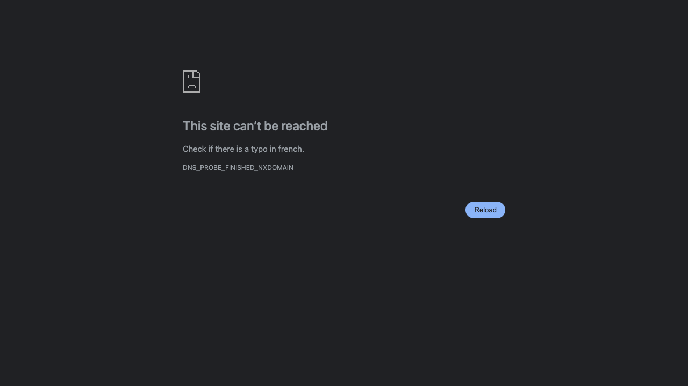

# ProofShot Verification Report

**Date:** 2026-07-29 22:25:30
**Project:** JADE IA
**Dev Server:** npm run dev on localhost:3000

## What Was Verified

JADE Expanded UI

## Video Recording

Full session recording: [session.webm](./session.webm) (4s)

## Screenshots

## Console Errors

No console errors detected.

## Server Errors

No server errors detected.

## Token Usage (Estimated)

- Input tokens: ~500
- Output tokens: ~300
- Total tokens: ~800
- Estimated cost: ~$0.0060
- Source: estimated from session activity

## Environment
- Browser: Chromium (headless)
- Viewport: 1280x720
- Duration: 4 seconds
